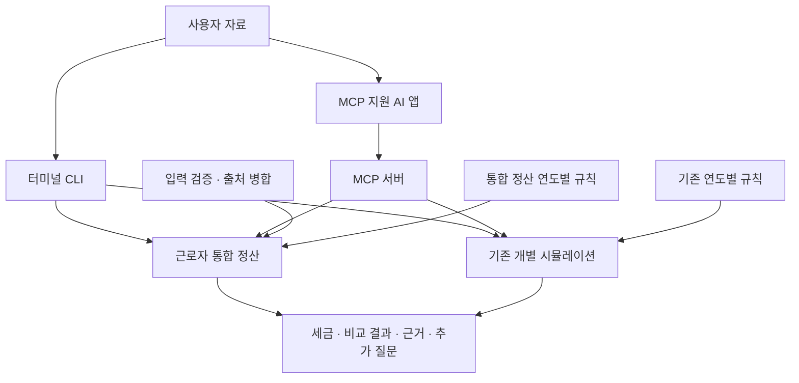

# Korean-market-tax-asset-management-agent

한국 직장인의 **예상 세금·연말정산 환급액과 절세 시나리오를 계산**하는 Python 프로젝트입니다.
급여, 보험료, 월세, 연금 납입 등의 정보를 입력하면 계산 결과와 적용 근거,
추가로 필요한 자료를 확인할 수 있습니다.

현재는 터미널에서 실행하거나 MCP를 지원하는 AI 앱에 연결해 사용합니다.
별도의 웹 화면이나 홈택스 자동 조회 기능은 제공하지 않습니다.

## 1. 프로젝트 사용 방법

### 설치하고 예제 실행하기

Git과 `uv`가 설치된 환경이 필요합니다. Python 3.12 이상을 사용합니다.

```bash
git clone https://github.com/newkimjiwon/Korean-market-tax-asset-management-agent.git
cd Korean-market-tax-asset-management-agent
uv sync --extra mcp --extra dev
uv run python -m ktax examples/synthetic_settlement.json --json
```

마지막 명령은 합성 자료로 2026년 연말정산을 계산합니다. 개인정보 없이 먼저
결과 형식을 확인할 수 있습니다.

| 결과에서 볼 항목 | 의미 |
|---|---|
| `baseline.tax.total` | 공제·감면을 반영한 예상 세금 합계 |
| `baseline.settlement.refund` | 이미 낸 세금과 비교한 예상 환급액 |
| `baseline.settlement.additional_payment` | 예상 추가 납부액 |
| `actions` | 추가 납입·공제 신청 등의 개별 비교 시나리오 |
| `baseline.next_questions` | 계산에 부족한 정보를 채우기 위한 질문 |
| `status` | 예상 계산인지, 자료 부족인지 등을 나타내는 상태 |

현재 규칙의 전체 검증은 완료되지 않아 계산 결과는 `provisional`(예상)로
표시됩니다. 추천별 절세액은 서로 독립적인 비교이므로 더해서 사용하지 않습니다.

### 내 자료로 계산하기

먼저 **[준비할 자료와 작성 목록](docs/getting-started.md)**을 확인하세요.
급여명세서의 급여·비과세 금액, 국민연금·건강보험·장기요양보험·고용보험,
이미 낸 소득세·지방소득세가 기본 자료입니다. 월세·감면·연금 납입 등은 해당할 때
추가로 준비합니다.

- 금액이 월 기준인지 연간 누계인지 구분합니다. 도구가 자동으로 연간 환산하지 않습니다.
- 모르는 값은 생략하거나 `null`로 둡니다. 확인한 없음만 `0`으로 입력합니다.
- 기납부 세금만 모르면 예상 세금은 계산할 수 있어도 환급액은 확정할 수 없습니다.
- 실제 자료는 저장소 밖의 개인 파일에서 관리하고 예제·테스트에 넣거나 커밋하지 않습니다.

입력 파일은 최상위에 `year`와 `settlement`를 갖는 JSON입니다.
[합성 입력 파일](examples/synthetic_settlement.json)에서 구조를 확인하고,
[상세 입력 설명](docs/salary-settlement.md)에 맞춰 작성합니다.

```bash
# 경로를 본인이 준비한 저장소 밖 JSON 파일 경로로 바꾸세요.
uv run python -m ktax /absolute/path/to/private-settlement.json --json
```

### AI 앱에 연결하기

MCP는 AI 앱이 이 프로젝트의 계산 기능을 호출할 수 있게 하는 연결 방식입니다.
앱의 **로컬 MCP 서버 설정**에 다음 실행 정보를 등록합니다. 설정 화면과 파일 형식은
앱마다 다릅니다.

| 설정 | 값 |
|---|---|
| 실행 명령 | `uv` — 앱이 찾지 못하면 설치된 실행 파일의 절대 경로 |
| 인자 | `--directory`, `프로젝트의 절대 경로`, `run`, `python`, `-m`, `ktax.server` |
| 연결 방식 | stdio |

연결한 뒤에는 “연말정산 예상 계산에 필요한 자료부터 물어봐 줘”라고 요청할 수
있습니다. 앱은 입력 항목을 조회하고 자료 부족 여부와 계산 결과를 설명할 수 있습니다.
MCP 서버는 브라우저에 여는 웹 서비스가 아닙니다.

### 현재 계산할 수 있는 범위

| 기능 | 지원 범위 |
|---|---|
| 근로자 통합 정산 | 2025·2026년 일반 거주자의 근로소득, 보험료, 기본공제, 중소기업 감면, 월세·지원금, 연금계좌 |
| 환급·추가 납부 예상 | 필요한 정산 입력과 기납부 소득세·지방소득세가 있을 때 |
| ISA 및 개별 절세 비교 | 별도 시뮬레이션. ISA는 보유기간 전체 투자 세금 비교이며 올해 환급액과 분리 |
| 카드·의료비·기부금 등의 통합 반영 | 자격과 한도를 별도로 확인한 공제액 입력. 원자료를 모두 자동 계산하는 기능은 미지원 |

기존 개별 시뮬레이션은 2025년 규칙을 사용하며 일부 한도·특례가 빠져 있습니다.
통합 정산의 2026년 지원이 모든 기능의 2026년 지원을 뜻하지 않습니다.
다른 소득이 섞인 경우, 비거주자 등은 통합 정산의 지원 범위를 벗어납니다.
자세한 조건은 [계산 범위 문서](docs/salary-settlement.md)를 확인하세요.

## 2. 프로젝트 구성과 아키텍처

입력과 계산을 분리하고, 세율·공제 한도는 귀속연도별 JSON 파일에서 읽습니다.
터미널과 MCP는 같은 Python 계산 모듈을 사용합니다.



**통합 정산**은 실제 급여 원자료로 세금과 환급액을 함께 계산하는 기본 경로입니다.
**기존 개별 시뮬레이션**은 미리 산출한 소득공제·세액공제 총액을 받아
행동별 절세 효과, 가치 비교, 임계값 변화를 확인하는 경로입니다.

```text
.
├── src/ktax/
│   ├── __main__.py             # 터미널 실행 진입점
│   ├── server.py               # MCP 도구 연결
│   ├── settlement.py           # 근로자 통합 정산·시나리오 비교
│   ├── settlement_schema.py    # 입력 항목·질문·자료 출처
│   ├── settlement_sources.py   # 통합 정산 자료 병합·충돌 처리
│   ├── rules/
│   │   ├── settlement/         # 통합 정산용 연도별 규칙
│   │   └── data/               # 기존 시뮬레이션용 연도별 규칙
│   ├── models.py               # 기존 프로필·결과의 공통 타입
│   ├── tax.py                  # 개별 세액·투자 세금 비교
│   ├── catalog.py              # 절세 항목별 적용 여부 판단
│   ├── value.py / scoring.py   # 효과의 가치 환산·정렬
│   ├── assumptions.py          # 가치 평가에 쓰는 가정
│   ├── sources.py              # 기존 프로필 출처·변화 처리
│   └── monitor.py              # 임계값·스냅샷 비교
├── examples/                   # 개인정보 없는 합성 입력
├── tests/                      # 계산·입력·CLI·도구 테스트
├── docs/                       # 사용·입력·개발 상세 문서
└── pyproject.toml              # Python 버전·의존성 설정
```

계산 모듈이 사용자 자료를 자체 보관하지는 않습니다. 파일·대화·출력 기록의
보관은 실행 환경에서 관리합니다. 외부 기관의 자료 조회나 주기적인 실행은
별도로 연결해야 합니다.

### 테스트 실행

```bash
uv run pytest -q
```

테스트는 구현 오류와 회귀를 확인합니다. 세법 전체의 검증 완료를 의미하지는 않으며,
규칙별 검증 상태와 미지원 범위는 데이터와 결과에 함께 표시합니다.

## 상세 문서

| 문서 | 내용 |
|---|---|
| [처음 사용하는 분을 위한 안내](docs/getting-started.md) | 준비 자료, 작성 목록, 모르는 값 처리 |
| [근로자 통합 정산](docs/salary-settlement.md) | 상세 입력 형식, 계산 순서, 지원 범위 |
| [개발·에이전트 연동](docs/developer-guide.md) | 도구 호출 흐름, 출처 관리, 가치 평가, ISA 입력 |
| [계산 요구사항](docs/real-user-calculation-requirements.md) | 실제 사용 과정에서 도출한 요구사항과 설계 기준 |
